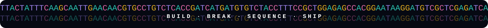

  

  
  
  
  
  

  

  

## 🧬 Three hats, one loop

| 🤖 AI / ML | 🧫 Bioinformatics | 🚀 Founder |
|:--|:--|:--|
| Agentic AI, RAG, LLM evaluation, fine-tuning, computer vision | Merged PRs into **Trapiche** (Finn Lab) and **MalariaGEN Data Python** | **CTO** at Mana Intelligence, building **Vibely** - an agent that builds and ships software |
| Python, PyTorch, LangChain, FastAPI | Genomic data tooling, sequence analysis | **Co-founder** of **postnp** - an autonomous 24/7 AI marketing agent |
| Prompt engineering, evals, retrieval | Open-source, reproducible science | Product lead on **KALQY** - motion-controlled learning games for ages 3-6 |

The loop: biology gives me messy, high-stakes data → ML gives me tools to make sense of it → startups force me to ship it.

## 📄 Research & open source

- 📝 **NPvert: Structure-First RAG for LaTeX Document Synthesis** - co-authored, published in *LPCPS ELIXIR*
- 🧬 Contributor - [Trapiche](https://github.com/finnlab) · [MalariaGEN Data Python](https://github.com/malariagen/malariagen-data-python)

## 🛠️ Stack

  

  
  
  
  
  
  
  
  

## 📊 Activity

  
  

  <picture>
    <source media="(prefers-color-scheme: dark)" srcset="https://raw.githubusercontent.com/bleedblack1/bleedblack1/output/github-snake-dark.svg"/>
    
  </picture>

  

  

